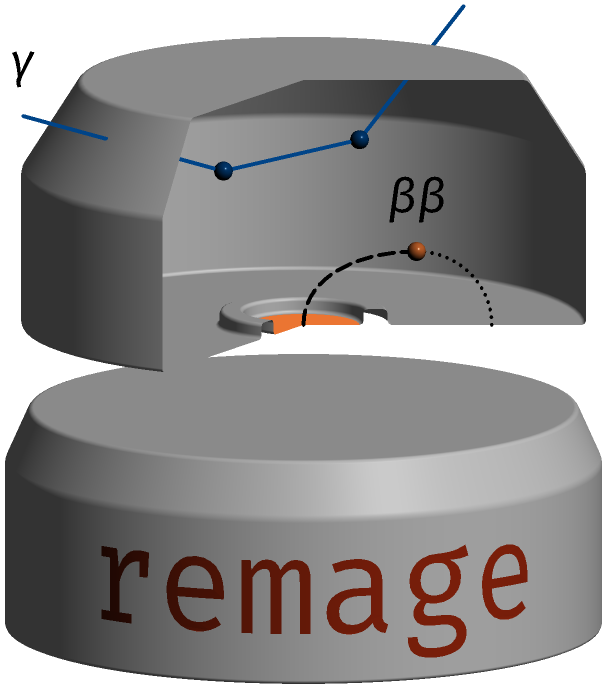

# remage

Simulation framework for low background physics experiments

 

Monte Carlo simulations are an essential tool for data modeling and experimental
design in low-background physics. They typically demand a considerable effort,
with each collaboration developing and maintaining its own complex
[Geant4](https://geant4.web.cern.ch) application. _remage_ is an open-source
framework designed to standardize these simulations and significantly reduce
this effort.

Its design separates the experimental geometry, built with dedicated Python
tools, from the compiled application. It provides a physics list and event
generators tuned to radiogenic and cosmogenic backgrounds, output tailored to
the most common detector types, and robust validation backed by modern software
development practices. The software is distributed ready to use and scales
efficiently with the computing resources that demanding simulations require.
_remage_ has been primarily developed for the [LEGEND](https://legend-exp.org)
experiment, but is applicable to a wide variety of others.

Get started with our [documentation pages](https://remage.readthedocs.io)!

### Main features

- Low entry barrier: Most simulations can be executed directly using the
  `remage` executable and a macro file, eliminating the need to write or compile
  C++ code.
- Ready-to-use distribution:
  [conda-forge](https://anaconda.org/conda-forge/remage) packages and
  pre-compiled container images on
  [Docker Hub](https://hub.docker.com/r/legendexp/remage)
- Geometry decoupled from the application: it is supplied as a
  [GDML](https://gdml.web.cern.ch/GDML) file, conveniently generated from Python
  with [legend-pygeom-tools](https://github.com/legend-exp/legend-pygeom-tools)
- Support for modern [Geant4](https://geant4.web.cern.ch), including:
  - Multithreading, complemented by a custom multi-process mode for consistent
    speedups on large machines
  - Multiple output file formats ([ROOT](https://root.cern.ch),
    [HDF5](https://www.hdfgroup.org/solutions/hdf5)...)
- [LEGEND HDF5 (LH5)](https://legend-exp.github.io/legend-data-format-specs/dev/hdf5/)
  primary output format, with wide support in multiple languages (e.g. Julia,
  Python)
- Physics list tuned for low-background applications, with production cuts and
  step limits suited to high-precision modeling of HPGe detectors
- Fast third-party cosmic muon generator (through
  [EcoMug](https://doi.org/10.1016/j.nima.2021.165732))
- Support for external generators, by reading in the files they produce:
  - cosmic muons generated with
    [MUSUN](https://doi.org/10.1016/j.cpc.2008.10.013)
  - neutron capture gamma cascades computed with
    [MAURINA](https://doi.org/10.1140/epja/s10050-024-01336-0)
- Third-party double-beta decay generator (through
  [bxdecay0](https://github.com/BxCppDev/bxdecay0))
- Advanced vertex confinement on physical volumes, geometrical solids, surfaces
  and intersections
- Event vertices and kinematics can also be read from HDF5 files, so that
  generators can be written in any language (e.g. with
  [revertex](https://github.com/legend-exp/revertex))
- Sensible output schemes for HPGe and optical detectors
- Data reduction and speedup mechanisms: step clustering, output filtering and
  conditional tracking (track staging and suspension)
- Continuously updated
  [validation suite](https://legend-exp.github.io/remage/validation/latest),
  including end-to-end comparisons with experimental data, run automatically for
  every change to _remage_ or Geant4
- Automatically generated documentation of all _remage_ macro commands
