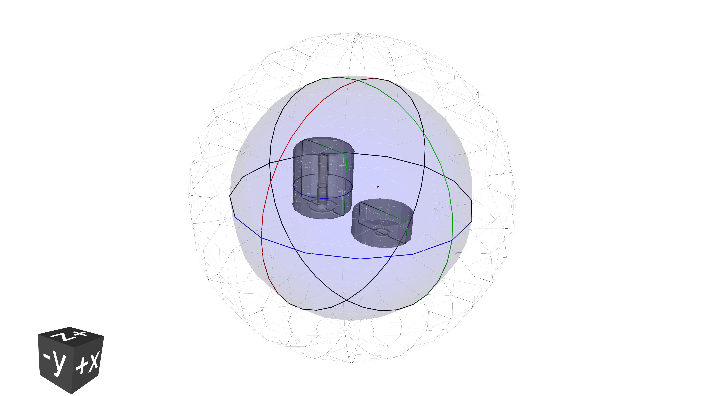
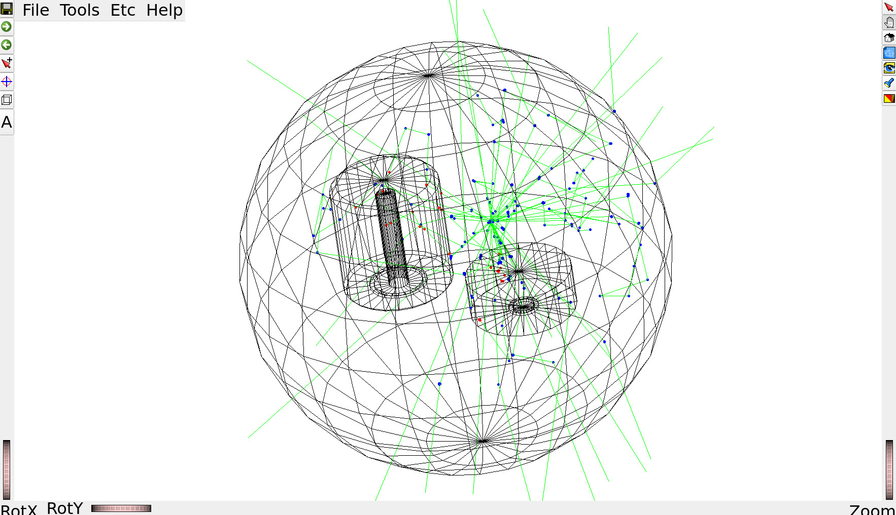
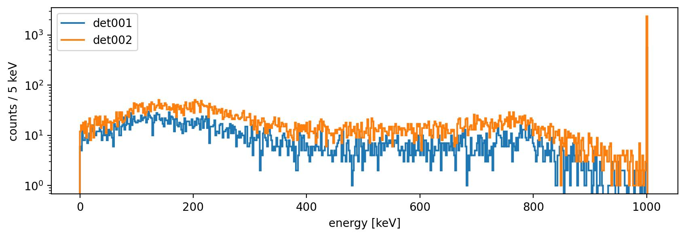
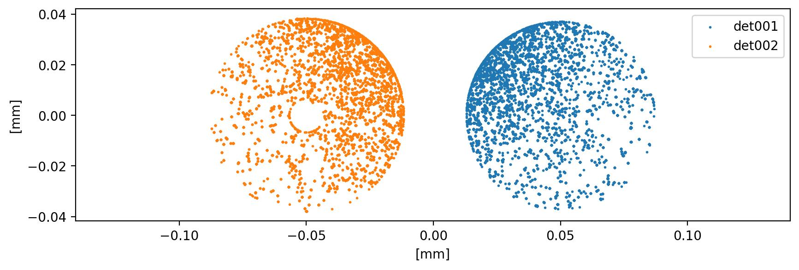

# Basic Tutorial

In this tutorial we are going to demonstrate the basic functionality of
*remage* by simulating a series of particle physics processes in a simple setup.

## Experimental geometry

We need to develop a geometry, and we will be using the
[pyg4ometry](https://pyg4ometry.readthedocs.io) library for this purpose. This
library is well-suited for creating geometries that are compatible with the
Geant4 framework, as it closely mirrors the Geant4 interface, making it easy
for those familiar with Geant4 to use. Importantly, pyg4ometry is independent
of Geant4 itself, meaning it doesn't require Geant4 as a dependency.
Additionally, it offers the flexibility to export the developed geometry in
GDML format, which is widely compatible for simulations and analyses in
high-energy physics applications.

The geometry consist in two high-purity germanium detectors (HPGes) immersed in
a liquid argon balloon. The
[legend-pygeom-hpges](https://legend-pygeom-hpges.readthedocs.io) package will
help us creating the HPGe volumes. Let's start by importing the Python
packages, declaring a geometry registry and specifying the dimensions and types
of the two detectors as dictionaries:

```python
import legendhpges as hpges
import pyg4ometry as pg4
from numpy import pi


reg = pg4.geant4.Registry()

bege_meta = {
    "name": "B00000B",
    "type": "bege",
    "production": {
        "enrichment": {"val": 0.874, "unc": 0.003},
        "mass_in_g": 697.0,
    },
    "geometry": {
        "height_in_mm": 29.46,
        "radius_in_mm": 36.98,
        "groove": {"depth_in_mm": 2.0, "radius_in_mm": {"outer": 10.5, "inner": 7.5}},
        "pp_contact": {"radius_in_mm": 7.5, "depth_in_mm": 0},
        "taper": {
            "top": {"angle_in_deg": 0.0, "height_in_mm": 0.0},
            "bottom": {"angle_in_deg": 0.0, "height_in_mm": 0.0},
        },
    },
}

coax_meta = {
    "name": "C000RG1",
    "type": "coax",
    "production": {
        "enrichment": {"val": 0.855, "unc": 0.015},
    },
    "geometry": {
        "height_in_mm": 84,
        "radius_in_mm": 38.25,
        "borehole": {"radius_in_mm": 6.75, "depth_in_mm": 73},
        "groove": {"depth_in_mm": 2, "radius_in_mm": {"outer": 20, "inner": 17}},
        "pp_contact": {"radius_in_mm": 17, "depth_in_mm": 0},
        "taper": {
            "top": {"angle_in_deg": 45, "height_in_mm": 5},
            "bottom": {"angle_in_deg": 45, "height_in_mm": 2},
            "borehole": {"angle_in_deg": 0, "height_in_mm": 0},
        },
    }
}
```

Now we can build all the logical volumes and place them in the world volume:

```python
# create logical volumes for the two HPGe detectors
bege_l = hpges.make_hpge(bege_meta, name="BEGe_L", registry=reg)
coax_l = hpges.make_hpge(coax_meta, name="Coax_L", registry=reg)

# create a world volume
world_s = pg4.geant4.solid.Orb("World_s", 20, registry=reg, lunit="cm")
world_l = pg4.geant4.LogicalVolume(world_s, "G4_Galactic", "World", registry=reg)
reg.setWorld(world_l)

# let's make a liquid argon balloon
lar_s = pg4.geant4.solid.Orb("LAr_s", 15, registry=reg, lunit="cm")
lar_l = pg4.geant4.LogicalVolume(lar_s, "G4_lAr", "LAr_l", registry=reg)
pg4.geant4.PhysicalVolume([0, 0, 0], [0, 0, 0], lar_l, "LAr", world_l, registry=reg)

# now place the two HPGe detectors in the argon
pg4.geant4.PhysicalVolume([0, 0, 0], [5, 0, -3, "cm"], bege_l, "BEGe", lar_l, registry=reg)
pg4.geant4.PhysicalVolume([0, 0, 0], [-5, 0, -3, "cm"], coax_l, "Coax", lar_l, registry=reg)

# finally create a small radioactive source
source_s = pg4.geant4.solid.Tubs("Source_s", 0, 1, 1, 0, 2*pi, registry=reg)
source_l = pg4.geant4.LogicalVolume(source_s, "G4_BRAIN_ICRP", "Source_L", registry=reg)
pg4.geant4.PhysicalVolume([0, 0, 0], [0, 5, 0, "cm"], source_l, "Source", lar_l, registry=reg)
```

Note how we also created a small cylinder to represent a radioactive source
later in the simulation.

Now we can quickly visualize the result, still with *pyg4ometry*:

```python
# start an interactive VTK viewer instance
viewer = pg4.visualisation.VtkViewerColoured(materialVisOptions={"G4_lAr": [0, 0, 1, 0.1]})
viewer.addLogicalVolume(reg.getWorldVolume())
viewer.view()
```



## Visualizing a simple simulation

By following instructions in the [installation](./install) section, you should
have access to the `remage` executable. We are now ready to simulate some
particle physics with it.

Like any other Geant4-based application, we need to configure the simulation
with a macro file. Standard Geant4 commands as well as custom commands (see the
[command interface](./rmg-commands)) are available.

At the beginning of the file, we can set some global application options, like
the verbosity. Let's increase it a bit (compared to the default `summary`) to
be more informed on what's going on by *remage*:

```text
/RMG/Manager/Logging/LogLevel detail
```

Then we have to register the "sensitive detectors" (in our simple case, the two
HPGes and the LAr). *remage* offers several types of predefined detectors,
targeting different physical quantities of the particles that interact with
them. HPGes are of type `Germanium`, while the LAr is of type `Scintillator`.
Their difference in terms of simulation output will be clear later, while
inspecting it. As per specification of the `/RMG/Geometry/RegisterDetector`
command, we need to provide a unique numeric identifier that will be used to
label the detector data in the simulation output:

```text
/RMG/Geometry/RegisterDetector Germanium BEGe 001
/RMG/Geometry/RegisterDetector Germanium Coax 002
/RMG/Geometry/RegisterDetector Scintillator LAr 003
```

Now we can initialize the simulation. Additionally, let's setup some Geant4
visualization to look at the tracks:

```text
/run/initialize

# create a scene
/vis/open OI
/vis/scene/create
/vis/sceneHandler/attach

# draw the geometry
/vis/drawVolume

# setup better colors
/vis/viewer/set/defaultColour black
/vis/viewer/set/background white

# and also show trajectories and particle hits
/vis/scene/add/trajectories smooth
/vis/scene/add/hits
/vis/scene/endOfEventAction accumulate
```

Now with the actual physics. We want to start ten 1 MeV gammas from the
radioactive source:

```text
/RMG/Generator/Confine Volume
/RMG/Generator/Confinement/Physical/AddVolume Source

/RMG/Generator/Select GPS
/gps/particle gamma
/gps/ang/type iso
/gps/energy 1000 keV

/run/beamOn 50
```

:::{admonition} Complete macro file (`vis-gammas.mac`)
:class: dropdown

```text
/RMG/Manager/Logging/LogLevel detail

/RMG/Geometry/RegisterDetector Germanium BEGe 001
/RMG/Geometry/RegisterDetector Germanium Coax 002
/RMG/Geometry/RegisterDetector Scintillator LAr 003

/run/initialize

/vis/open OI
/vis/scene/create
/vis/sceneHandler/attach

/vis/drawVolume

/vis/viewer/set/defaultColour black
/vis/viewer/set/background white

/vis/scene/add/trajectories smooth
/vis/scene/add/hits
/vis/scene/endOfEventAction accumulate

/RMG/Generator/Confine Volume
/RMG/Generator/Confinement/Physical/AddVolume Source

/RMG/Generator/Select GPS
/gps/particle gamma
/gps/ang/type iso
/gps/energy 1000 keV

/run/beamOn 10
```
:::

We can finally pass the GDML geometry and the macro to the `remage` executable
and look at the result!

```console
$ remage --interactive --gdml-files geometry.gdml -- vis-gammas.mac
  _ __ ___ _ __ ___   __ _  __ _  ___
 | '__/ _ \ '_ ` _ \ / _` |/ _` |/ _ \
 | | |  __/ | | | | | (_| | (_| |  __/
 |_|  \___|_| |_| |_|\__,_|\__, |\___| v0.3.0
                           |___/

[Summary -> Realm set to DoubleBetaDecay
[Summary -> CLHEP::HepRandom seed set to: 647993209
[Summary -> Loading macro file: vis-gammas.mac
...
```

:::{note}
Interactive visualization requires passing `--interactive` to the `remage` executable.
:::

Interactions in HPGes and in LAr are marked in red and blue, respectively.



:::{tip}
With Apptainer, additional tweaks are required in order to allow for graphics to be displayed, e.g.
```console
$ apptainer run \
    --env DISPLAY=$DISPLAY \
    --env XDG_RUNTIME_DIR=$XDG_RUNTIME_DIR \
    --env XAUTHORITY=$XAUTHORITY \
    -B $XDG_RUNTIME_DIR \
    path/to/remage_latest.sif --interactive [...]
```
and similarly with Docker.
:::

:::{tip}
If `remage` from the Apptainer image refuses to run simulations, this might be
due to some of your environment variables from outside the container. Give
`--cleanenv` a try.
:::

## Storing simulated data on disk

Let's now simulate more events in batch mode and store Geant4 step information
in an output file. Using the same macro as before, without the visualization
commands:

```text
/RMG/Manager/Logging/LogLevel detail

/RMG/Geometry/RegisterDetector Germanium BEGe 001
/RMG/Geometry/RegisterDetector Germanium Coax 002
/RMG/Geometry/RegisterDetector Scintillator LAr 003

/run/initialize

/RMG/Generator/Confine Volume
/RMG/Generator/Confinement/Physical/AddVolume Source

/RMG/Generator/Select GPS
/gps/particle gamma
/gps/ang/type iso
/gps/energy 1000 keV

/run/beamOn 100000
```

We will simulate 10^5 events. Profiting from Geant4's multithreading
capabilities, we can speed up the simulation but running it on several threads
in parallel. The number of threads is specified with the `--threads` command
line option.

Now we only need to tell `remage` which file name to use for the output.
`remage` supports multiple file formats, including [LEGEND's
HDF5](https://legend-exp.github.io/legend-data-format-specs). We are going to
select the latter by supplying a file name with `.lh5` extension:

```console
$ remage --threads 8 --gdml-files geometry.gdml --output output.lh5 -- gammas.mac
```

Geant4 does not support merging LH5 files created by different threads, so
we're left with 8 output files: `output_t0.lh5 ... output_t7.lh5`. This seems a
bit annoying, but it's easy to chain them when reading data into memory.

We'll use the [legend-pydataobj](https://legend-pydataobj.readthedocs.io)
Python package to read the data from disk. Let's first have a look at the
data layout with the `lh5ls` utility:

```console
$ lh5ls output_t0.lh5
/
└── stp · struct{det001,det002,det003,vertices}
    ├── det001 · table{evtid,particle,edep,time,xloc,yloc,zloc}
    │   ├── edep · array<1>{real} ── {'units': 'keV'}
    │   ├── evtid · array<1>{real}
    │   ├── particle · array<1>{real}
    │   ├── time · array<1>{real} ── {'units': 'ns'}
    │   ├── xloc · array<1>{real} ── {'units': 'm'}
    │   ├── yloc · array<1>{real} ── {'units': 'm'}
    │   └── zloc · array<1>{real} ── {'units': 'm'}
    ├── det002 · table{evtid,particle,edep,time,xloc,yloc,zloc}
    │   ├── edep · array<1>{real} ── {'units': 'keV'}
    │   ├── evtid · array<1>{real}
    │   ├── particle · array<1>{real}
    │   ├── time · array<1>{real} ── {'units': 'ns'}
    │   ├── xloc · array<1>{real} ── {'units': 'm'}
    │   ├── yloc · array<1>{real} ── {'units': 'm'}
    │   └── zloc · array<1>{real} ── {'units': 'm'}
    ├── det003 · table{evtid,particle,edep,time,xloc_pre,yloc_pre,zloc_pre,xloc_post,yloc_post,zloc_post,v_pre,v_post}
    │   ├── edep · array<1>{real} ── {'units': 'keV'}
    │   ├── evtid · array<1>{real}
    │   ├── particle · array<1>{real}
    │   ├── time · array<1>{real} ── {'units': 'ns'}
    │   ├── v_post · array<1>{real} ── {'units': 'm/ns'}
    │   ├── v_pre · array<1>{real} ── {'units': 'm/ns'}
    │   ├── xloc_post · array<1>{real} ── {'units': 'm'}
    │   ├── xloc_pre · array<1>{real} ── {'units': 'm'}
    │   ├── yloc_post · array<1>{real} ── {'units': 'm'}
    │   ├── yloc_pre · array<1>{real} ── {'units': 'm'}
    │   ├── zloc_post · array<1>{real} ── {'units': 'm'}
    │   └── zloc_pre · array<1>{real} ── {'units': 'm'}
    └── vertices · table{evtid,time,xloc,yloc,zloc,n_part}
        ├── evtid · array<1>{real}
        ├── n_part · array<1>{real}
        ├── time · array<1>{real} ── {'units': 'ns'}
        ├── xloc · array<1>{real} ── {'units': 'm'}
        ├── yloc · array<1>{real} ── {'units': 'm'}
        └── zloc · array<1>{real} ── {'units': 'm'}
```

The step information is organized into data tables, one per sensitive detector.
The table format is specified by the detector type (`Germanium` or
`Scintillator`). Event vertex information is stored in a separate table,
`vertices`. Note the physical units specified as attributes, as per LH5
specification.

Let's make an histogram of the total energy deposited in the HPGe detectors in
each event. Check out the [legend-pydataobj
documentation](https://legend-pydataobj.readthedocs.io) for more details.

```python
from lgdo import lh5
import awkward as ak
import glob
import hist
import matplotlib.pyplot as plt

plt.rcParams["figure.figsize"] = (10, 3)

def plot_edep(detid):
    # read the data from detector "detid". pass all 8 files to concatenate them
    # in addition, view it as and Awkward Array
    data = lh5.read_as(f"stp/{detid}", glob.glob("output_t*.lh5"), "ak")

    # with awkward arrays, we can easily "build events" by grouping by the event identifier
    evt = ak.unflatten(data, ak.run_lengths(data.evtid))

    # make and plot an histogram
    hist.new.Reg(551, 0, 1005, name="energy [keV]").Double().fill(ak.sum(evt.edep, axis=-1)).plot(yerr=False, label=detid)

plot_edep("det001")
plot_edep("det002")
plt.ylabel("counts / 5 keV")
plt.yscale("log")
plt.legend()
```



The expected spectrum, composed by full-energy peak at 1 MeV and Compton
shoulder. We can also plot the interaction points:

```python
def plot_hits(detid):
    data = lh5.read_as(f"stp/{detid}", glob.glob("output_t*.lh5"), "ak")[:20_000]
    plt.scatter(data.xloc, data.yloc, marker="o", s=1, label=detid)

plot_hits("det001")
plot_hits("det002")
plt.xlabel("[mm]")
plt.ylabel("[mm]")
plt.legend()
plt.axis("equal")
```



## Advanced usage

*remage* can do much more than this! While we prepare more documentation, be
aware that a lot of the simulation and the output can be customized:

- commands below `/RMG/Output` are available to filter steps, isotopes, store
  all steps in a single table etc.
- physics list settings can be adjusted
- the randomization can be controlled
- advanced vertex confinement modes are implemented
- many interesting event generators, related to germanium detector experiments
  are available
- vertex coordinates can be read from an input file
- the simulation of optical physics can be optimized

Have a look at the [API reference](./api/index) and the [macro command
reference](./rmg-commands).
